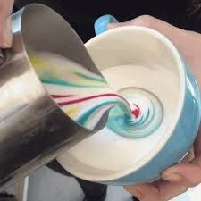
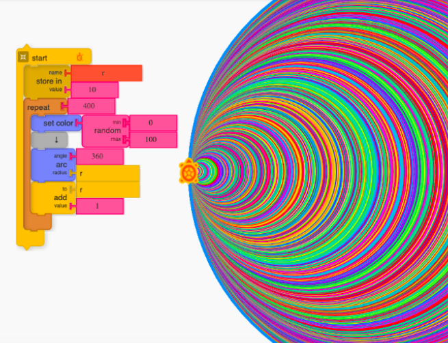
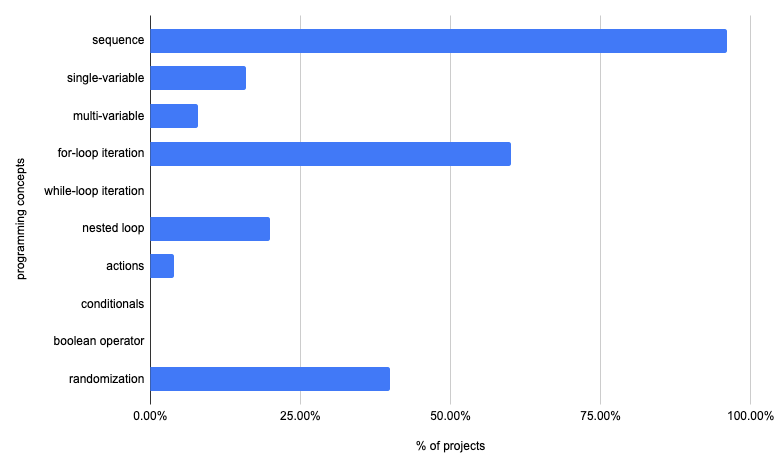
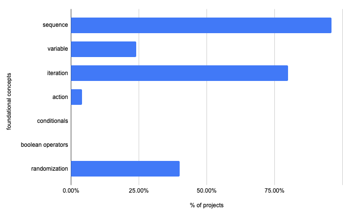
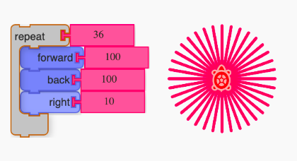
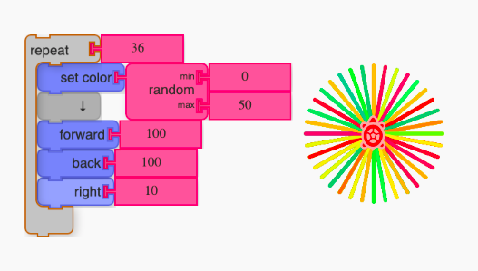
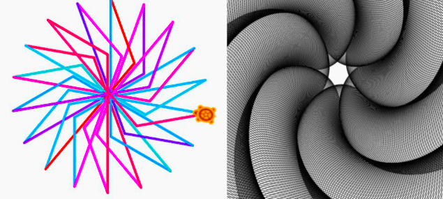
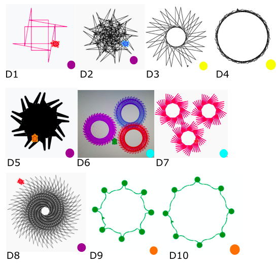

- [Abstract](#abstract)
- [Introduction](#introduction)
- [Design](#design)
  - [Framework](#framework)
  - [Session Design](#session-design)
  - [Session wise summary](#session-wise-summary)
  - [Settings](#settings)
  - [Data Sources](#data-sources)
  - [Sample](#sample)
- [Observations](#observations)
  - [Project Files Analysis](#project-files-analysis)
- [Discussion](#discussion)
  - [The not so Random Story](#the-not-so-random-story)
  - [Opportunities for discovery and surprises](#opportunities-for-discovery-and-surprises)
  - [Implicit understanding of concepts](#implicit-understanding-of-concepts)
  - [Project Challenges as prompts](#project-challenges-as-prompts)
- [Conclusion](#conclusion)
- [References](#references)
- [Appendix](#appendix)

## Abstract

Today, there is an ubiquitous presence of computing devices all around. Digital fluency is considered as one of the important skills to successfully navigate in this connected world. (We can add the aspects of 21st century skills which involve computing) Resnick has argued that opportunities need to be created to empower learners to not just consume the products of digital technology, but to actually create those themselves. (Resnick, 2012) Getting familiar with the foundational programming concepts form the first-step to nurture the computational tinkering skills and enhance digital fluency(??). In the constructionist framework specially designed programmes, called as *microwords*, are recommended for developing holistic approach to use of computers in learning.

In this article, we explore the design and implementation of an introductory module in turtleBlocks microworld and how it supports the introduction of core concepts in alignment with the constructionist approach. Our observations indicate that turtleBlocks not only supports the nurturing of foundational concepts but also develops a sense of positive attitude towards programming and a deeper connection with the (learning?) environment. We also discuss the learnings which will be useful for practitioners to improvise the design of the module in the next iterations.

> **Keywords:** Microworld, Constructivism, Pedagogy, Digital Fluency, Computational Thinking, Teacher Education, Learning, Creativity, Turtle Blocks

## Introduction



It's probably hard to see the connection between programming and Fig 1 at the first sight. Here is the artwork shared by one of the participant using turtle Blocks inspired by Fig 1,

<!--- (this should go a bit later) -->
[//]: # (this should go a bit later)



Turtle Graphics is not a new approach to introduce programming to young people. It’s historical roots goes back to 1967 when the LOGO, a computer language specifically designed for learning, was first developed at MIT by Papert, Wally et. al. Thereafter, there have been several implementations of turtle Graphics approach to introduce programming to young people. As of 2020, there are over 300 implementations (turtle tree project). Papert also developed the theory of constructionism to understand the learning process during the design and implementation of LOGO (Papert 1980, 1993).

Constructionist learning encourages one to learn by creating artefacts (digital/physical) and sharing it with others for feedback or as a showcase. A microworld, like LOGO can be considered as an instantiation of a constructionist learning environment. It’s a safe, low-barrier to entry environment which provides opportunities to  actively construct knowledge by making artefact.(Noss and Hoyles, 2017)  LOGO is considered a microworld where the learner is empowered to encounter powerful ideas by engaging in the creation of personally meaningful artefacts (Lawler, 1982). Examples of other microworlds to introduce programming include scratch, snap, turtle Blocks, TI LOGO, Alice etc.

Today, the web-based technologies have made it possible to access some of these programs online via a web browser. turtleBlocks is a microworld designed by SugarLabs to introduce programming (is that the only aim?) to first-time learners (https://turtle.sugarlabs.org/). It is a FOSS (Free and Open Source Software) and released under General Public License (GPL). It supports knowledge construction by empowering learners with authoring tools to create and share computationally generated graphics. Learners can design these graphics by manipulating a turtle (an object) on the screen using simple commands. The drag-drop gesture can be used to bring the colour-coded blocks from the command palette in the drawing area and snap them like LEGO pieces to complete the code. Different blocks have different functionality which is also represented by its shape making (?) and colour. The block-based programming approach allows the learner to focus on the logical structure of the code rather than debugging the syntactical errors related to language. (Resnick, 2012)

There is also a wealth of literature to connect the exploration of turtle Graphics with mathematical thinking, especially in the area of geometry and algebra.(Abelson and DiSessa, 1981; Papert, 1972, this is ancient history, we need some recent publications in this theme) This has a pedagogical implication for the educationists to meaningfully integrate subject-matter (content knowledge?) with digital technologies. The prerequisite for such cross-disciplinary and meaningful integration starts with the nurturing of the foundational understanding of core-programming concepts which will be the focus of this article. (What are core-programming concepts? Is there any definition somewhere?)

For example, Newell, B. (1988) has already suggested that it's the perspective change which will be more challenging to effectively marry the turtle Graphics approach with formal mathematics. He argued that teachers are already familiar with the formal knowledge, and one needs to design suitable interventions to facilitate this perspective change for successful integration. Since turtle Graphics approach already had a lot of avenues for interdisciplinary integration while simultaneously building digital fluency and nurturing core foundational principle, it was the suitable choice for the pilot. (This needs a bit of elaboration and rewording)

The article explores the design process of an open-ended personally and meaningful exploration to enhance computational participation and digital fluency in alignment with constructionist approach. The goal was to keep the engagement meaningful, accessible, personalized and universal. The preliminary observations indicate that certain programming concepts are not very intuitive for every learner and require more nudging and facilitation on part of the designer. The analysis of the observational data also indicates that even with little effort (this is not clear) in an online mentoring setup, the intervention can play an instrumental role to springboard learners towards open-ended contextual exploration along with developing a positive attitude towards programming.

## Design

### Framework

Programming concepts like randomization, iterations, control flow structures, variables and operators form important building blocks in learning to code. (How do we know this?) These are also applicable across different programming environments.(possible link: As such, these concepts were the learning objective (LOs) that were kept in focus while designing the task/activity/session (we should use any one of them consistently))

(This is a sudden jump from the previous paragraph)
The sessions in turtle Blocks were designed to include sequencing, iterations (loops, nested loops), conditionals , operators, data(stepping variables), events(action) according to the framework suggested by Brennan, K. and Resnick, M. (Brennan and Resnick, 2012). These elements form the basic structure of the coding block in similar microworlds like Scratch. (See Fig 5 Resnick, M. et al.,2009). In addition to the elements suggested, an additional concept of randomization was added to the list.

A total of six sessions were designed which had a gradual transition and integration of the concepts during the subsequent sessions. (were the sessions increasing in difficulty?)

Comment: This is implementation - framework usually means the theoretical framework -- for example the framework that is used to make sense of the whole study -

### Session Design

A series of six sessions was designed and spaced across three-weeks to make the participants explore the turtle Blocks. 

The following themes were explored in the sessions:

| Session                                                                                    | New Blocks                             | Computational Concepts                                      |
| ------------------------------------------------------------------------------------------ | -------------------------------------- | ----------------------------------------------------------- |
| **S1:** Introduction about turtle Blocks environment; Making polygons: square and triangle | forward, left, back, right             | sequences                                                   |
| **S2:** Understanding iterations: Making a rainbow spoke art                               | repeat & forever ; for & while; random | sequences, loops                                            |
| **S3:** Understanding steeping variable and nested loops: Making a spiral square           | box, nested repeat                     | sequences, loops, data                                      |
| **S4:** Citation and documentation; Making a multi-colour disk                             | random with forward                    | sequences, loops, data                                      |
| **S5:** Making procedure modular and manageable                                            | if; action                             | sequences, loops, events, conditionals, data                |
| **S6:** Making VIBGYOR Wheel                                                               | if-else; OR AND                        | sequences, loops, events, conditionals, operators, and data |

### Session wise summary

During the three weeks, there was a gradual increase in complexity and abstraction of the projects covering all the foundational concepts in the introductory programming.

- In the first session, the movement (forward and backward) and rotation(left and right) of the blocks were discussed. Simple polygons (square and triangle) were designed to elicit the same.
  
- In the second session, the participants were exposed to the functionality of the repeat block and forever block. A color wheel was made using random and colour blocks.
  
- In the third session, the concept of stepping variables was introduced while attempting to make spiral square artWork by [Michel](https://commons.wikimedia.org/wiki/File:Fig-2-Spiral-drawn-with-TurtleArt.gif).
  
- In the fourth session, we discussed some best practices to document one's work and also how to cite resources from Wikipedia. This was in context to the third session, where we used an artwork by Michel and made remixes around it. An irregular circular disc was designed eliciting the concept of nested repeat and using using a random block with forward.
  
- In the fifth session, we explored the concept of conditional statements and defining reusable-modular procedures. The if and action block were used to make nested polygon design.
  
- In the sixth session, a VIBGYOR wheel was used as a design challenge to engage the participants. This required the accurate placement of turtle on the specific location on the screen, hence one has to carefully synchronise the position of the turtle as well as track the colour variable to generate the requisite pattern. The coordinate system and set-xy block was used to implement the same.
  
At end of each session a design challenge was presented to the learners, who had to complete the challenge and post it to the group on a specially created Telegram channel. 


### Settings

- The participants were located in geographically different locations. (this should go in the section: sample)
- Live session was conducted using the webinar platform.(this should go in the previous section)
- This session duration was 60 min each, twice a week. (this should go in the previous section)
- The online interaction had provision for a chat interface to ask doubts, real-time poll, and screen sharing options.(this should go in the previous section)
- A group was also created in an instant messaging platform with the mentors, participants and parents. The purpose of the group was to encourage community-driven engagement by sharing challenges asynchronously.(this should go in the previous section)

### Data Sources

The data was collected primarily from three sources

1. Reflection Sheet shared after the sessions were completed (See Appendix)
2. Project files shared by the participants.
3. Interaction data on the chat group were of two types
   - Textual discussion on the IM platform by cohort members
   - Community Project Challenges

### Sample

- 9 participants registered to be part of the online intervention
- Four volunteered to be part of pilot study and shared reflection sheets and project files separately.
- The participant's distribution across grade was as follow:
  - Grade 4-5: 1
  - Grade 6-8: 1
  - Grade 9-12: 1
  - Adult: 1
- Six participants shared project files in the group settings as part of their contribution to OER. These are used to make a collective portfolio. The participants identities are anonymized.

## Observations

In this section, we share the analysis of the project files and discuss some episodes connecting them to the affordances of the turtle Graphics to support personally meaningful explorations.

### Project Files Analysis

The frequency of usage of programming blocks and the application of concepts like stepping variables, control flow statements, abstraction, modularization can be used to determine the fluency and familiarity in the programming environment. (Portelance,2005; Resnik,Scratch).

In total 25 new projects were shared by the four participants. Projects were mapped according to the programming concepts discussed in section 2. Sub-categories were created for the variable (data) and iteration.

The summary is as follow:

- Repeat block was used in 15 projects
- Forever block was used in 1 project.
- A nested repeat was used in 5 projects.
- Data
  - A single variable was used in 4 projects
  - multiple variables were used in 2 projects
- Randomization
  - The random block was used in 10 projects
- Conditionals and Operators
  - Not used in any project
- Action (Functions)
  - Action block was used in one project.

It is interesting to note that 10 of these contained programming blocks like arc, shade, hue which were not discussed during the online sessions. (So what does it mean? What is the take home point here?)



| Programming Concepts  | Number of projects | in percent |
| --------------------- | ------------------ | ---------- |
| total unique projects | 25                 | 100        |
| sequence              | 24                 | 96         |
| single-variable       | 4                  | 16         |
| multi-variable        | 2                  | 8          |
| for-loop iteration    | 15                 | 60         |
| while-loop iteration  | 0                  | 0          |
| nested loop           | 5                  | 20         |
| actions               | 1                  | 4          |
| conditionals          | 0                  | 0          |
| boolean operators     | 0                  | 0          |
| randomization         | 10                 | 40         |

Here is the category wise representation of data according to the framework suggested by Brennan, K. and Resnick,



| Foundational Concepts | Number of projects | in percent |
| --------------------- | ------------------ | ---------- |
| total unique projects | 25                 | 100        |
| sequence              | 24                 | 96         |
| variable/data         | 6                  | 24         |
| iteration             | 20                 | 80         |
| events/action         | 1                  | 4          |
| conditionals          | 0                  | 0          |
| boolean operators     | 0                  | 0          |
| randomization         | 10                 | 40         |

Most of the projects just involved the usage of sequencing, iteration and randomization. Conditional statements and operators were hardly used and the concept of the variable was used in just 6 projects out of 25. The data indicates that most participants found it easy to apply simple blocks in combination with repeat and random to create various designs. Concepts such as control flow and operators require deliberate facilitation and more opportunities to help the participants internalize and apply.


* Q:  What framework was used to analyse data?
* How did you analyse the data?
* 

## Discussion
 In this section, we look at some specific affordances of the program design which strengthens the links.
Building fluency, competency, the connection in microworld is dependent on many factors (not clear).

### The not so Random Story

How many of us remember when we were introduced random numbers? Was the experience profoundly engaging? This is how the random number is introduced in most of the introductory CS courses for the first time learners, (the tone suddenly changes)

One of the recurring patterns in the reflection sheet of the participants indicated the fondness for the random block. This is also reflected in the project files where 10 projects used the random block. The following are some of the comments shared by the participants:

> **P1:** Random block is my favourite block. Because of the random block using a colour block I made my art colourful. That’s why this is my favourite block.
>
> **P2:** I used the random block to make my art colourful.
>
> **P3:** Random as it is enigmatic.

It might be useful to look closely at the specific affordance of the turtle Graphics (use consistently) approach which helped in forging the connection and also contrast it with the conventional way random is introduced in other text-based popular languages. We take the example of python and C++ to compare the syntax of the same with turtle Blocks.

Here are examples of generating random integers in the range of 0-50 in all these 3 environments,

**Example 1: C++,**

```cpp
#include <stdio.h>
#include <stdlib.h>

void main () {
   int i, n;
   n = 5;
   /* Print 5 random numbers from 0 to 50 */
   for( i = 0 ; i < n ; i++ ) {
      printf("%d\n", rand() % 50);
   }
}
```

**Example 2: python,**

```python
import random
print(random.randrange(0, 50))
```

**Example 3: turtle Blocks**




In C++ and python, one can surely think of much more interesting ways to make the code appealing but as one can see, it comes with additional overhead. The context becomes inaccessible for novices due to the complexity of code and esoteric domain of application making it harder to generalize.

In the turtle graphics approach, we can see how simple art can be converted into a multi-colour wheel by introducing a random block. This output also generates a sense of awe and excitement in the process. This is where the true potential of the platform can be realized. One is not restricted to make a wheel, but now the participants are empowered to use this simple block and apply it in the artwork which they find personally meaningful to create. Hence, it will be hard to achieve the same result keeping the accessibility barrier low. Mircoworlds are designed to have low threshold and high/no ceiling.


### Opportunities for discovery and surprises

One of the powerful features of computationally powered graphics is the versatility of the designs which are possible during the learning process. Here we see three examples, of how the microworld supports discoveries and increase chances for serendipitous moments during the exploration,

In the first scenario, even if one decides to work towards making a specific design, the process of breaking down and working bottom-up to generate complex shapes allows one to encounter awe and surprise during the process. This is resonated in the response shared by the participant (P_N?).

> CatHeart is my favourite artwork. Once I saw this drawing on the internet and thought to program the same on sugar labs. It failed many times...but at last it worked. While programming this, many new shapes were formed other than a cat on the heart."

Secondly, even if one starts with an existing project, the opportunity to take code snippets and remix them to create new designs is a common practice in turtle Blocks microworld. One of the participants shared,

> I explored and created new designs, made a remix of some of the Artworks. In every session, I got to learn something different, something new.(P_N?)

Thirdly, even by keeping the code structure the same, making slight changes in the argument value can lead to interesting output which at many times can't be anticipated. This is due to the parameterized nature of the artWork embedded in an artistic context making it possible for limitless easily tweak-able designs to emerge.

> What I liked most about turtle art is that you can do any design you want. By changing one number in the code you can make a whole new design.(P_N?)

The visual feedback, tinkerability of blocks, aesthetic appeal and accessibility of the platform makes the overall experience of exploration enjoyable for both novices and expert tinkerers. This is in alignment with the "low-threshold" and "high ceiling" design of microworld according to constructionist design.

One of the respondents remarked,

> "I liked the way the blocks are made. You simply clip the blocks to the program just like hanging clothes to a hanger. You can club your commands, add and remove and try different combinations."(P_N?)

Resnick has also pointed to the same in the context of scratch microworld. The very affordance of "low-threshold" and "high ceiling" makes the journey in the turtle Graphics enjoyable. (There is a paper by Walter Bender also which says similar)

To summarize, the very power of the same code structure to generate different design adds to the awe and surprise. The visual affordance of the platform to support the try-view-modify cycle in playful ways, makes even the bug finding an enjoyable discovery-rich context.

### Implicit understanding of concepts

The discovery of variations can also help in building an implicit understanding of the foundational programming concept. Here, we have two examples to illustrate the same,

Example 1: Variable as something that varies

Conveying the notion of variable as something which "changes" can get elicited in the context of generating diverse variation in the same design. One of the participant shared,

> Store in is a great box as it lets you define your box and all the manipulations you wish to do with it without changing values of other boxes. Easy one-step and you can get so many variations.(P_N?)

Example 2: Understanding iteration in context of writing concise code

> My favourite block is the repeat block because we can just write the steps once and use the repeat block. We don't have to write the same steps again and again.(P_N?)

### Project Challenges as prompts

Projects challenges were yet another strategy incorporated in the program intervention to increase the likelihood for participants to better navigate and choose the projects they might find interesting.
There were two facilitation decisions which went alongside the implementation of project challenges. The challenge was kept "voluntary" and "cohort-driven". Firstly, there was no compulsion for anyone to participate in any challenge. Secondly, any members of the group can share project challenges for their peers to work on. There was a mutual understanding among the community that even if one finds the answer, one would defer sharing the project code on the group since that will not let others to experience the opportunity to attempt here. Below are three examples of how the challenges were an integral part of the overall intervention design.

The first example is of the challenges which are shared by the participants. The participants were encouraged to create their design and share those during the 3-weeks intervention. This is also in alignment with sharing the artefact with the community in the constructionist approach. Here are some challenges shared by the members,



The second example is standing on the shoulder of the community. turtle Graphics indeed has a rich repository of projects online (https://turtle.sugarlabs.org/). To ease the navigation of the participants, we curated turtle Art challenges at one place. This acts as the idea zone and showcase for the diversity of projects which are possible and already attempted by several people.
Here is the link of [turtleArt Challenge Wiki.](https://metastudio.org/t/turtleart-challenges-wiki/4036/8)

The third case is indeed a very interesting one which we didn't anticipate. This is also an example of how contextual connections can emerge unexpectedly and trigger serendipitous exploration in the form of project challenges which becomes personally meaningful for some participants.

Here is a canvas of various designs attempts done by the members (colour represents unique member) to make an artwork resembling "coronavirus"



It started when one of the participants shared design D2 (which is a complex version of D1) on the group as a normal challenge. One of the mentors saw that as an opportunity to engage the cohort by announcing to make the "turtle draw coronavirus".

What we saw next is gradual sharing of the designs during the intervention periods by four members (three participants and another mentor) as their attempt to draw coronavirus. This episode also illustrates how connection between the microworld and real-life can be forged in open-ended and creative ways.

Here is an example of conversion when D6 was shared by one of the participants,

> **Mentor:** This is very innovative and special. Can you now use this model to create a coronavirus challenge? clue: reduce the length, and alter the angles, increase the number of iterations on the circle.

> **Another Participant:** We can also increase the pen size.

To summarize, the challenge serves both as an inspiration prompt and also as an opportunity to support self-learning. If designed carefully and creatively, these can support creative expression alongside building computational skills in a personally meaningful context.

## Conclusion

The preliminary finding indicates that some concepts were used less often than the other. The low frequency of the concepts to appear in project files might be due to the later induction of some of the concepts and their inherent complexity. Even though the ceiling for entry into the microworld is low, the ceiling for exploration of the computational concepts in complex projects is not low and requires time, effort and patience. This can often get overlooked due to the benefits the microworld offers and the general tenet of low-ceiling exploration in microworld. In (cite), the authors propose that it takes just 15 min to engage in Scratch microworld and start making interactive projects. It will be more useful to also be aware about the distinction between the project creations and the computational thinking concepts which are honed during such exploration.
The pilot indicates that there are conceptual gaps which need to be addressed to help learners become fluent and familiar in the microworld. It takes time and effort on both the learner and students to develop the fluency.
The followings suggestions may be useful for the future iterations,

- More focus and time should be given on projects which involve the application of concepts in an integrated manner to better help learners internalize the same.
- Care must be given towards gradual scaffolding of the concepts and techniques to make the transition smooth.
- The projects shared during the session should convey the potentiality of the microworld to participants and support personally relevant exploration.

The intertwined nature of commitment towards supporting personally relevant exploration coupled with the specific affordance of the platform, mentorship and facilitation, carefully designed sessions and challenge prompts makes the overall experience holistic and meaningful for the learner. This has potential to organically develop a positive identity as a programmer and also a deeper connection with the microworld.

The article highlights the importance of gradual scaffolding of the computational concepts and proposes that these should be elicited within the context of creating personal meaning projects via turtle Blocks as a case study. This approach also sets the stage for the teachers of any discipline to focus on assessment less, open-ended creative exploration leveraging the true potential of the constructionist learning environment.

**Acknowledgement**

The authors would like to sincerely thank all the children and their parents who encouraged their children to participate in the pilot study.  
The authors would also like to thank all mentors who encouraged the children and nudged their thinking towards creative pursuits.

**Mentors:** Nagarjuna G, Jude T Dsuza, Spruha Satavlekar, Amit Dhakulkar, Ashish Pardeshi, Sandeep Satavlekar  
**Wiki Challenges authors:** Amit Dhakulkar and Ravi Sinha  
**Online sessions facilitator:** Ravi Sinha

Any opinions, findings, and conclusions or recommendations expressed in this material are those of the authors and do not necessarily reflect the views of the institute.

**Statements on data, ethics and conflicts of interest**

The participants were given full anonymity in the study and voluntary consent from the guardian has been obtained. A research brief was shared with the participant's guardian which indicated the purpose of the study. They were also informed that participation in the study is voluntary.

The authors reports no conflicts of interest.

## References

Abelson, H. and DiSessa, A. A. (1981) Turtle geometry: the computer as a medium for exploring mathematics. Cambridge, Mass: MIT Press (The MIT Press series in artificial intelligence).

Papert, S. (1972) ‘Teaching Children to be Mathematicians Versus Teaching About Mathematics’, International Journal of Mathematical Education in Science and Technology, 3(3), pp. 249–262. doi: 10.1080/0020739700030306.

Noss, R. and Hoyles, C. (2017) ‘Constructionism and Microworlds’, in Duval, E., Sharples, M., and Sutherland, R. (eds) Technology Enhanced Learning. Cham: Springer International Publishing, pp. 29–35. doi: 10.1007/978-3-319-02600-8_3.

Lawler, R. W. (1982) ‘Designing computer based-microworld p139’, BYTE Publication INK, August.

Resnick, M. (2012) ‘Mother’s Day, Warrior Cats, and Digital Fluency: Stories from the Scratch Online Community’, p. 7.

Brennan, K. and Resnick, M. (2012) ‘New frameworks for studying and assessing the development of computational thinking’, p. 25.

Resnick, M. et al. (2009) ‘Scratch: programming for all’, Communications of the ACM, 52(11), pp. 60–67. doi: 10.1145/1592761.1592779.

## Appendix

**A. Reflection Sheet**

The following were the questions in the reflection sheet:

1. Have you done programming before?
2. How is your experience of programming now after the turtleArt sessions?
3. What is something which you liked most about turtleArt? What you didn’t like?
4. Share your favourite artwork. Why is it your favourite? What was the inspiration which initiated it? What things you tried that worked? What didn't work? Are there some interesting discoveries you made while exploring? What are the challenges you faced?
5. Share your favourite block. Why is it your favourite?
6. The overall experience of the 3-week session. Learnings and challenges
